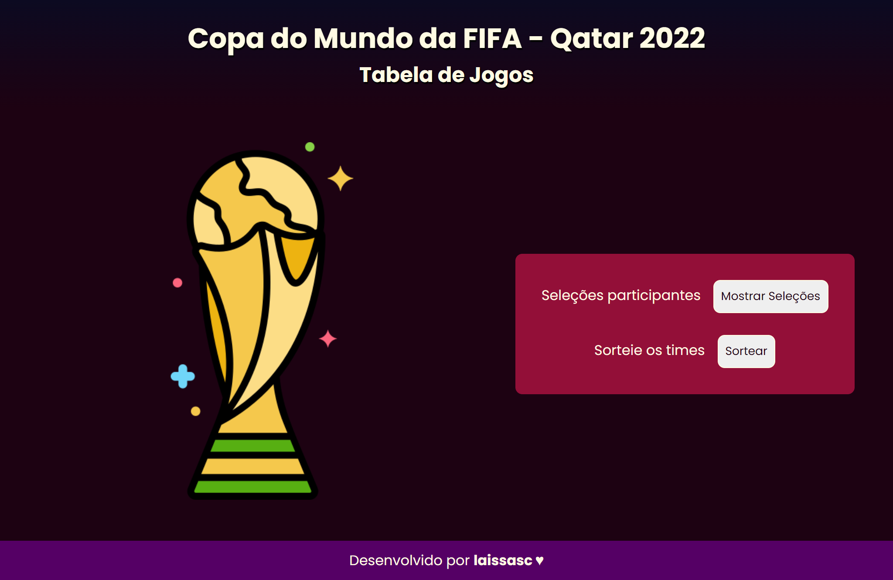
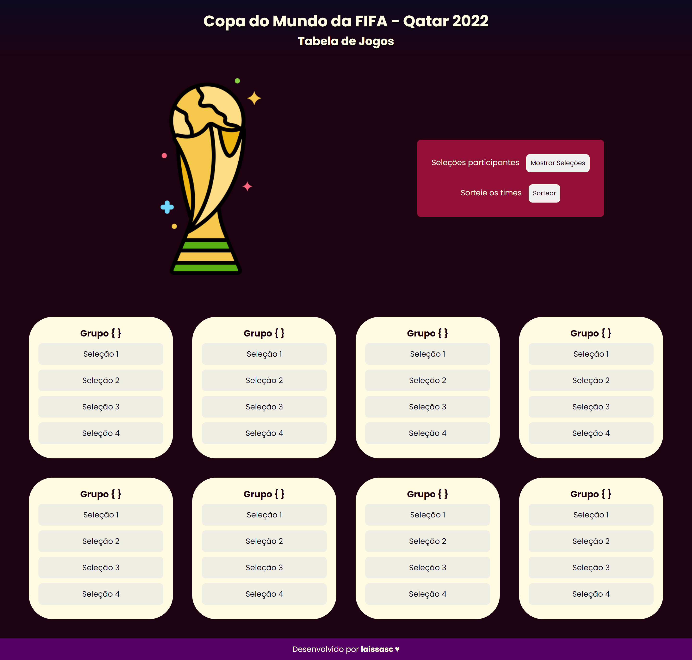
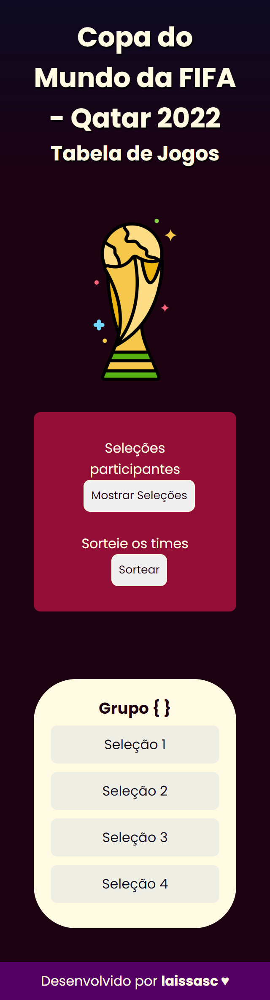

# Tabela de Jogos da Copa do Mundo  

&nbsp;
&nbsp;
&nbsp;
&nbsp;
 

## Qual será o desafio? 
O objetivo do projeto é consumir de uma API as 32 seleções participantes da Copa do Mundo, e a partir dessas informações dividir as seleções de maneira aleatória para jogar as etapas eliminatórias da Copa. Ao final do projeto, o resultado da partida final deverá ser enviado para a API.  

### Tecnologias a serem usadas 

HTML, CSS e JavaScript.  

### Aprendizados 
Utilizando meu conhecimentos de HTML e CSS, criei as versões desktop e mobile da Aplicação.

👩🏾‍💻 JavaScript ainda em construção ...   

.
.

### Versões ativas! 
.
.